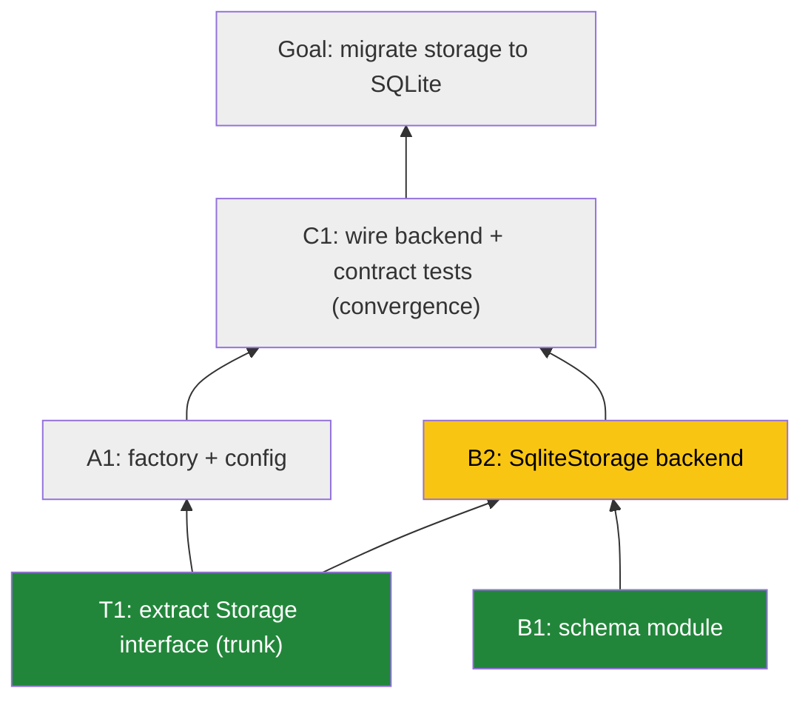

# Mikado Execution — Agent Guide

<!-- Companion to AGENTS-mikado-planning.md. Load this during execution. -->

This guide covers executing an **approved** Mikado plan: running parallel agents,
isolating work in worktrees, opening PRs, converging, and narrating progress. The
plan itself — graph, design decisions, diagrams — lives in `MIKADO.md` and was
produced per the planning guide. **Never start execution before the user has
approved the plan.**

## Core concepts (shared with the planning guide)

- **Mikado Method**: build a dependency graph of prerequisites, work from the leaves, parallelize independent branches.
- The graph is a **DAG, not a strict tree** — a node may have prerequisites in more than one branch (cross-branch edges).
- **Node roles**: **root** `G` = the goal; **trunk** = a node ≥2 branches depend on (shared interface/contract/schema/protocol); **branch** node; **convergence** = a node fed by >1 branch.
- **Node IDs** are stable and hierarchical: root `G`; trunks `T1, T2…`; branches `A, B, C…`; nodes `A1, A2…` where `A1` merges before `A2`.
- **Statuses**: `pending` / `in-progress` / `done`.
- **Artifacts**: `MIKADO.md` at the repo root is the canonical graph (goal, diagrams, node table, branch boundaries, collapse plan). This guide and the planning guide tell agents how to act in each phase.

## 1. Re-sync before you touch anything

Agents get swapped and context windows roll over mid-effort — so never trust memory over the written plan. Before starting or resuming any work:

- **Re-read `MIKADO.md`** — the canonical graph, node statuses, branch boundaries, and collapse plan are ground truth.
- **Check live state** — which PRs are open/merged (`gh pr list`), which nodes are `done`, and what your branch's file boundary is.
- **Confirm your change still fits.** Anything you write must accord with the current graph, the architecture docs, and other agents' in-flight work. If reality has drifted from the plan, run the discovery loop (§2) and reshape the graph — don't quietly build something the graph doesn't describe.

## 2. Parallel agent execution

- After trunk nodes merge, identify the **independent branches** — subtrees whose remaining nodes share no files or tightly coupled modules.
- Spin up **one agent per independent branch**. Each works its branch leaf-first, sequentially, one PR per node.
- An agent NEVER starts a node until **all its prerequisites are merged — including cross-branch ones**.
- An agent stays inside its branch's file boundary. If it must touch another branch's territory, the graph is wrong: restructure (usually merge the two branches into one sequenced branch) via a plan-revision PR.

### The discovery loop — attempt → revert → record → recurse → reshape

The core Mikado move, not an error path. Discovering a hidden prerequisite mid-node means the method is working.

1. **Attempt honestly.** Start the node as planned; let the code reveal what's missing. Timebox it — if you're fighting the codebase, that's the signal.
2. **Revert clean — don't nurse half-work.** Commit nothing from the failed attempt; `git reset --hard` to clean. Keep it in a scratch stash/branch for reference if useful, but the node restarts from clean once its prerequisites are met. Half-finished work carried forward is how graphs rot.
3. **Record what reality taught you.** Add the discovered node/edge to `MIKADO.md` with a one-line note of what the attempt revealed ("SqliteStorage can't type against a protocol that doesn't exist yet") — the edge's *reason* is as valuable as the edge.
4. **Recurse before resuming.** The prerequisite may have its own prerequisites. Probe cheaply first (what does it import, touch, or assume that isn't merged?); if still uncertain, spend a timeboxed spike. Walk down to a true leaf — one revert per level beats discovering the chain one failed PR at a time.
5. **Reshape the graph.** Classify the prerequisite and act:
   - **Mine** (inside my boundary) → insert it into my branch sequence before the blocked node; note it in my next PR.
   - **Another branch's territory** → record the cross-branch edge; work another available node or wait for that branch to merge it. Never reach across the boundary and build it myself.
   - **Shared / contract-shaped** (≥2 branches need it) → a trunk node discovered late. Pause affected branches and raise a **plan-revision PR**; if branch assignments or boundaries change, it re-triggers the approval gate (planning guide).
6. **Narrate it** (§5): what was attempted, what it revealed, what was reverted, how the graph changed — in the moment, not in a retro.

### Git worktrees — one per agent

- Each agent works in its **own detached worktree**, never a shared checkout: `git worktree add --detach ../<repo>-agent-A main`.
- Per-node branches are cut from latest `main` inside the worktree: `git checkout -b mikado/<node-id> main` (e.g. `mikado/A1`). The worktree provides isolation — no long-lived per-agent branch.
- Rebase on latest `main` and rerun tests before opening each PR; merges to `main` are serialized.
- On agent collapse (below), remove dead agents' worktrees (`git worktree remove`); the survivor continues in its own.

### Review & merge policy — the user merges, never the agent

- Agents **open** PRs; they never approve their own, never merge, never enable auto-merge. Opening the PR ends the node: post the checkpoint update (§5) with the PR link and what to look at, then wait.
- The user's PR review is the standing control point — the approval gate approves the *plan* once; review approves each *increment*. Bypassing it turns "reviewable PRs" into an unread changelog.
- Waiting on review does not idle the agent: it continues with its **next node stacked** on the pending one (below). Nothing it builds may merge ahead of its base.
- If several PRs await review, present a short **review queue** (node, PR link, one-line what-it-does, suggested order) rather than pinging one at a time.
- **Explicit opt-in exception only:** the user may pre-authorize auto-merge for a named class of PRs (e.g. "auto-merge green trunk PRs"). Scope it narrowly, record it in `MIKADO.md`, and never infer it from silence.

### Stacked node PRs (within a branch only)

- **Stacking is the default within a branch — don't wait for merges.** Base node N+1's PR on node N's branch (`mikado/A2` targets `mikado/A1`) and keep going, so the agent pipelines through its branch while earlier PRs sit in review. Each PR still shows only its own node's diff. GitHub retargets a stacked PR to `main` when its base merges; rebase and rerun tests then.
- **Stack up to the convergence node, then stop.** A convergence node can't stack on multiple parents — it starts from `main` once all its feeders have merged. Stack A1 → A2 → A3, then wait.
- **Never stack across branches.** That recreates exactly the coupling the graph exists to remove.
- **Use discretion on stack depth.** Stacking trades review latency for rebase churn: if early PRs are likely to change substantially in review, a deep stack means repeatedly rewriting everything above them. When a node's approach is uncertain, contested, or the user has signaled they want a close look, stop stacking and wait for that PR to settle. Nothing in a stack may merge ahead of its base.

### Convergence & collapse

- A **convergence node** is fed by more than one branch.
- When all its feeder branches have merged, the separate agents **collapse to one**: a single agent takes the convergence node and everything above it toward the root. The others terminate or move to still-open branches.
- Never have two agents active above a convergence point.
- Convergence nodes carry **conformance/contract tests** proving every implementation honors the trunk interface.

### Scaling beyond 2–3 agents

- **Parallelism is an output of planning, not an input.** Spawn one agent per *genuinely disjoint* subtree; never split branches to hit an agent count. Hotspots (DI wiring, route tables, config, lockfiles) cap useful parallelism — two candidate branches sharing a hotspot are one branch.
- **Keep nodes small so the merge queue cycles fast.** Every merge to `main` obsoletes other agents' bases; cheap rebases stay cheap only if PRs stay small. At high agent counts the bottleneck is review throughput — don't add agents past what review absorbs.
- **Nested convergences need survivors named up front.** With many branches, convergence is staged (A+B→C1, D+E→F1, C1+F1→G). The collapse plan must name the surviving agent *per convergence node*, or two survivors both claim the upper graph.
- **Optional conflict hardening:** add `MIKADO.md merge=union` to `.gitattributes` to eliminate status-table conflicts (safe only because agents edit exactly their own single-line row).

## 3. Keep code and docs honest

- **Comment code well**, and when you change code, **update the comments that describe it** — a stale comment misleads worse than no comment.
- **Keep architecture/flow docs current.** If a node changes components, boundaries, or a runtime path, update the SVG diagrams and `MIKADO.md` in the same PR. Architecture docs are living artifacts through execution, not a planning-time snapshot.

## 4. PR requirements

Write every node PR description **for a reader with almost no context** on what
you're building or why — plain vocabulary, acronyms defined on first use, and
explicit links to related PRs and the overall goal. A reviewer who has never seen
`MIKADO.md` must be able to review from the description alone. It is **first a
normal, excellent PR description, second a Mikado artifact**: lead with the
delivery, put plan context after a divider.

**Part 1 — the delivery (lead with this):**

1. **What changed & why** — 2–5 plain-language sentences: the behavior/capability this PR adds, the approach, and any non-obvious choice worth attention. Written for someone reviewing the diff, with any domain terms or acronyms spelled out.
2. **How this fits the bigger picture** — one or two sentences connecting it to the overall goal and naming related PRs (what merged before it, what it unblocks), so a low-context reader sees where the piece belongs.
3. **How to verify** — the command(s) to run and what output proves it works (test names count); note anything intentionally not covered yet and which node covers it.
4. **Acceptance criterion** — quote the node's "done when" from `MIKADO.md` and state how it's met.

**Part 2 — Mikado context (after a `---` divider):**

5. **Graph diagram** (Mermaid, snapshot as of this PR) with this PR's node marked and merged nodes styled differently. Every node shows its **ID and short label**:

**Color semantics — role in the border, status in the fill (never mix them):**
borders are stable roles — blue = trunk, purple = convergence, crimson = goal;
fills are live status — grey = pending, green = merged, yellow = **this PR**. A
merged trunk is blue-border + green-fill; the goal keeps its crimson border and
fills green only when G itself merges (so it never looks "done" from day one).
**Use this exact scheme in every PR's snapshot** so a reviewer comparing PRs reads
one consistent picture of what's done, in progress, and pending.

6. **Position statement**, one line: `Branch B, node B2 — 2nd of 2 on this branch. Feeds convergence node C1 (also fed by branch A).`
7. **Unblocks**, one line: which node(s) this merge unblocks, and whether it completes a feeder into a convergence node (triggering collapse).
8. **`MIKADO.md` row update**: this node's row flipped to `done` + PR link (same PR).

**Size check:** keep the diff **under 250 changed lines** whenever possible. If a node
is growing past that, it's two nodes — split it rather than shipping a PR too big to
review carefully.

**Balance check:** if Part 2 (diagram excluded) is longer than Part 1, Part 1 is
underwritten — a reviewer should never reverse-engineer the change from the plan.

## 5. Narrate the execution — don't batch-ship

Execution is a guided story, not a delivery truck. The user should always know where
in the graph we are, why the current work is happening, and what changed since they
last looked — without reading diffs to find out.

- **Checkpoint updates** at every phase boundary — trunks merged, each branch launched/completed, each convergence reached, each collapse, and G. Each is a short "what just landed (PR links) → what it proves → what starts now and why". A PR opening is not a substitute for saying what it means.
- **Narrate deviations in the moment.** Discovered edges, blocked nodes, restructures, contract changes: explain what was found, why the plan bends, and what it costs — when it happens, not in a retro. The user should never first learn of a plan change from a diff or a stale `MIKADO.md`.
- **Connect, don't enumerate.** Each update links back to the goal and the previous checkpoint ("with both stores passing the same contract, the API no longer cares which one serve wires in — that's what unblocks D1"), so the sequence reads as one argument, not a list of events.
- **Batch small mechanical steps** (rebases, row flips, worktree cleanup) into the next checkpoint rather than narrating each. Decisions and surprises get told immediately; mechanics get summarized.
- **Close with a recap**: node → PR map, what deviated from the approved plan and why, and anything learned that should feed back into these rules.

## 6. Crunch mode — explicit override only

Under time pressure the user may override the defaults above and authorize some
combination of: **larger-scope nodes and PRs**, **merging without their review**, and
**running agents in loops** to keep work moving as autonomously as possible.

- **Only when the user says so explicitly.** Never infer crunch mode from a deadline mentioned in the plan, from urgency in the task, from silence, or from a backed-up review queue. Absent an explicit switch, the defaults hold.
- **Honor exactly what was named, and nothing more.** "Merge these without me" doesn't also authorize 1,000-line PRs; "bigger PRs are fine" doesn't authorize skipping review.
- **Record it in `MIKADO.md`** — what was authorized, its scope, and when — so an agent picking up later doesn't inherit an override it can't see, or wrongly assume one is still active.
- **It expires.** Crunch mode applies to the work the user named; when that's done, revert to the defaults rather than carrying it forward.
- **These hold even in crunch:** tests green before merge, acceptance criteria met, `MIKADO.md` kept accurate, and deviations still narrated. Speed comes from bigger batches and less waiting — not from shipping work nobody can verify.
