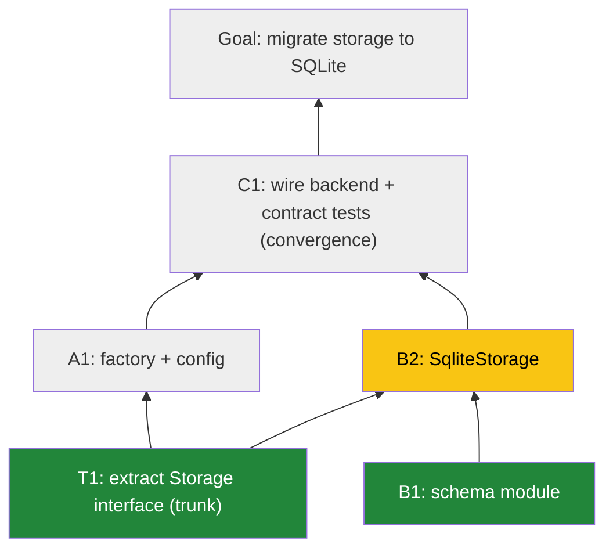

# Agent Instructions

<!-- If you already have an AGENTS.md, paste the section below into it. -->

## Mikado Planning & Parallel Agent Execution

When planning any non-trivial change, use the Mikado Method: build a dependency graph, work from the leaves, and parallelize across independent branches.

### 0. Design decisions before decomposition

Before drawing any tree, enumerate the load-bearing design decisions in a
**"Design decisions"** section at the top of `MIKADO.md`: data model, error &
status conventions, where config/secrets come from, external dependencies,
storage of any shared state. Each decision creates or dissolves cross-branch
edges — most hidden edges discovered mid-flight trace back to a decision nobody
wrote down (e.g. "where do auth tokens live?" decides whether auth depends on
persistence). An undecided item is a planning blocker, not a TODO.

For high-uncertainty areas, prefer a **throwaway spike first** to discover the
real prerequisite structure, then plan; and mark exploratory nodes with a
**risk flag** in the node table so they're sequenced early or conservatively.

**Architecture & flow diagrams are part of the plan, not optional garnish.**
Whenever the work changes structure (new components, boundaries, protocols,
integrations), `MIKADO.md` includes, alongside the dependency graph:

- a **target-architecture diagram** — components and their boundaries in the
  end state, with each component labeled with the branch/node that builds it
  (this is what makes branch boundaries and trunk contracts *visible* rather
  than asserted);
- a **flow diagram** for each key runtime path (e.g. request → auth → handler →
  store), since flows cross branch boundaries and are where contract
  mismatches surface.

The dependency graph says *in what order*; the architecture diagram says *what*;
the flow diagram says *how it behaves*. A plan with only the first is unreviewable.

### 1. Build the graph

- The **root** is the goal (the user's requested outcome).
- Each **child node** is a prerequisite: a change that must land before its parent can.
- Recurse until every **leaf** is a task that can be done *right now* with no unmet prerequisites.
- The structure is tree-*like* but is really a **DAG**: a node may have prerequisites in more than one branch (cross-branch edges). Record every edge you know of; hunt for shared prerequisites explicitly during planning — especially interfaces/contracts that multiple branches will build against.
- **Trunk-first**: any node that ≥2 branches depend on (shared interfaces, protocols, schemas, contracts) is a **trunk node**. Trunk nodes merge *before* parallel agents spin up. This prevents agents from blocking mid-branch on another branch's work.
- **Contracts specify failure modes, not just signatures.** A trunk contract must pin error cases: status codes, error-body shapes, null/edge behavior, and (where relevant) a reusable conformance test that implementations must pass. Happy-path-only contracts let parallel branches silently diverge and collide at convergence.
- **Contract freeze:** once a trunk contract merges, changing it requires a plan-revision PR that names every dependent branch — never a quiet edit inside a node PR.
- True to Mikado: the plan is a hypothesis and **attempts are how the graph learns**. If you start a node and discover a hidden prerequisite, don't push through — run the discovery loop (§3): revert clean, record the edge, probe recursively, reshape if needed. The graph is a living document; update it as reality corrects the plan.

#### Node requirements

Every node MUST be:

- **Discrete & individually deliverable** — lands on main by itself, leaves the codebase green (builds, tests pass) even if the parent goal isn't reached yet. Use feature flags, parallel implementations, or expand/contract patterns when needed to keep intermediate states shippable.
- **One reviewable PR** — target roughly ≤400 changed lines and a single conceptual change. If a node can't yield a small PR, split it into child nodes.
- **Independent within its branch** — nodes on *different* branches must not touch the same files/modules wherever possible. If two nodes must touch the same area, they belong on the same branch (sequenced), not on parallel branches. Minor overlap is acceptable only when merge conflicts would be trivial.
- **Explicit acceptance criteria** — every node's table row includes a one-line done-condition ("done when: \<observable behavior or named test passes\>"). If you can't write one, the node isn't individually deliverable — split or restructure it.

### 2. Persist the graph

- The canonical graph lives in **`MIKADO.md`** at the repo root (create it in the first PR of the effort).
- It contains: the goal, the Mermaid diagram (see §4), a node table, branch boundaries, and the convergence/collapse plan.
- Node IDs are stable and hierarchical: root is `G`, trunk nodes are `T1`, `T2`…, branches are `A`, `B`, `C`…, nodes are `A1`, `A2`, `B1`… where `A1` must merge before `A2`.
- **Statuses**: `pending` / `in-progress` / `done`. A node's own PR flips its row to `done` and adds the PR link — "done" means "done when this PR merges". No post-merge bookkeeping edits.
- **Conflict hygiene** (critical for parallel agents — verified to merge cleanly):
  - Each node is exactly **one table row on one line**. Agents edit *only their own node's row*.
  - The Mermaid diagram and prose are edited only in planning or plan-revision PRs, never in routine node PRs.
  - Rebase on latest `main` before opening a PR; `MIKADO.md` row conflicts should then be rare and trivially resolvable.

### 3. Parallel agent execution

- After trunk nodes merge, identify the **independent branches** — subtrees whose remaining nodes share no files or tightly coupled modules.
- Spin up **one agent per independent branch**. Each agent works its branch leaf-first, sequentially, one PR per node.
- An agent NEVER starts a node until **all its prerequisite nodes are merged — including cross-branch prerequisites**.
- An agent stays inside its branch's file boundary. If it must touch another branch's territory, the graph is wrong: restructure (usually merge the two branches into one sequenced branch) via a plan-revision PR.

#### The discovery loop — attempt → revert → record → recurse → reshape

This is the core Mikado move, not an error path. Discovering a hidden
prerequisite mid-node means the method is working.

1. **Attempt honestly.** Start the node as planned; let the code tell you what's
   missing. Timebox it — if you're fighting the codebase, that's the signal.
2. **Revert clean — don't nurse half-work.** Commit nothing from the failed
   attempt to the node branch; `git reset --hard` back to a clean state. You may
   keep the attempt in a scratch stash/branch *for reference*, but the node
   restarts from clean once its prerequisites are met — half-finished work
   carried forward is how graphs rot.
3. **Record what reality taught you.** Add the discovered node/edge to
   `MIKADO.md` with a one-line note of what the attempt revealed ("SqliteStorage
   can't type against a protocol that doesn't exist yet") — the edge's *reason*
   is as valuable as the edge.
4. **Recurse before resuming.** The discovered prerequisite may itself have
   hidden prerequisites. Probe it the cheap way first (what does it import,
   touch, or assume that isn't merged?); if still uncertain, spend a timeboxed
   spike. Walk down until you hit a true leaf — one revert per level beats
   discovering the chain one failed PR at a time.
5. **Reshape the graph.** Classify the discovered prerequisite and act:
   - **Mine** (inside my branch's boundary) → insert it into my branch sequence
     as a new node before the blocked one; note it in my next PR.
   - **Another branch's territory** → record the cross-branch edge; work another
     available node in my branch or wait for that branch to merge it. Never
     reach across the boundary and build it myself.
   - **Shared / contract-shaped** (≥2 branches will need it) → a trunk node
     discovered late. Pause affected branches and raise a **plan-revision PR**;
     if branch assignments or boundaries change, it re-triggers the §6 gate.
6. **Narrate it** (§7): what was attempted, what it revealed, what was reverted,
   how the graph changed — in the moment, not in a retro.

#### Git worktrees — one per agent

- Each parallel agent works in its **own detached worktree**, never a shared checkout:
  `git worktree add --detach ../<repo>-agent-A main`
- Per-node branches are cut from latest `main` inside the worktree: `git checkout -b mikado/<node-id> main` (e.g. `mikado/A1`). No long-lived per-agent git branch — the worktree provides the isolation.
- Rebase on latest `main` before opening each PR and rerun tests; merges to main are serialized.
- On agent collapse (below), remove dead agents' worktrees (`git worktree remove`); the surviving agent continues in its own.

#### Review & merge policy — the user merges, never the agent

- Agents **open** PRs; they never approve their own PRs, never merge, and never
  enable auto-merge. Opening the PR ends the node: post the checkpoint update
  (§7) with the PR link and what to look at, then wait.
- The user's PR review is the standing control point of this workflow —
  the §6 gate approves the *plan* once; review approves each *increment*.
  Bypassing it converts "reviewable PRs" into an unread changelog.
- While waiting, an agent may start its **next node stacked** on the pending one
  (see below) but nothing it builds may merge ahead of its base.
- If several PRs are awaiting review, present them as a short review queue
  (node, PR link, one-line what-it-does, suggested order) rather than pinging
  one at a time.
- **Explicit opt-in exception only:** the user may pre-authorize auto-merge for
  a named class of PRs (e.g. "auto-merge green trunk PRs"). Scope it narrowly,
  record the authorization in MIKADO.md, and never infer it from silence.

#### Stacked node PRs (within a branch only)

- **Within a branch, stacking is encouraged when review latency is the bottleneck:** base node N+1's PR on node N's branch (`mikado/A2` targets `mikado/A1`), so the agent can pipeline — start A2 while A1 is in review — and each PR shows only its own node's diff. GitHub retargets the stacked PR to `main` automatically when its base merges; rebase and rerun tests at that point.
- **Never stack across branches.** Cross-branch stacking recreates exactly the coupling the graph exists to remove, and convergence nodes can't stack on multiple parents anyway — they start from `main` after their feeders merge.
- Default remains sequential-on-main (open node N+1 after N merges) — simpler, and fine when reviews are fast.

#### Convergence & collapse

- A **convergence node** is a node fed by more than one branch.
- When all feeder branches of a convergence node have merged, the formerly separate agents **collapse to one**: a single agent takes the convergence node and everything above it toward the root. The other agents terminate (or are reassigned to still-open branches elsewhere in the graph).
- Never have two agents active above a convergence point.
- Convergence nodes are where separately built pieces meet a shared contract — they should carry **conformance/contract tests** proving all implementations honor the trunk interface.

#### Scaling beyond 2–3 agents

- **Parallelism is an output of planning, not an input.** Spawn one agent per *genuinely disjoint* subtree; never split branches to hit a target agent count. Codebase hotspots (DI wiring, route tables, config, lockfiles) cap useful parallelism — if two candidate branches share a hotspot, they're one branch.
- **Keep nodes small so the merge queue cycles fast.** Every merge to main obsoletes all other agents' bases; cheap rebases only stay cheap if PRs stay small. The bottleneck at high agent counts is PR review throughput — don't add agents past what review can absorb.
- **Nested convergences need survivors named up front.** With many branches, convergence is usually staged (A+B→C1, D+E→F1, C1+F1→G). The collapse plan must name the surviving agent *per convergence node*, or two survivors will both claim the upper graph.
- **Optional conflict hardening:** add `MIKADO.md merge=union` to `.gitattributes` to eliminate status-table conflicts entirely (safe only because agents edit exactly their own single-line row).

### 4. PR requirements

A node PR description is **first a normal, excellent PR description, second a
Mikado artifact** — a reviewer who has never seen MIKADO.md must be able to
review the PR from its description alone. Lead with the delivery; the plan
context comes after, under a divider.

**Part 1 — the delivery (lead with this):**

1. **What changed & why** — 2–5 sentences in plain language: the behavior/capability this PR adds, the approach taken, and any non-obvious implementation choice worth a reviewer's attention. Written for someone reviewing the diff, not someone auditing the plan.
2. **How to verify** — the command(s) to run and what output proves it works (test names count); note anything intentionally NOT covered yet and which node covers it.
3. **Acceptance criterion** — quote the node's "done when" from MIKADO.md and state plainly that/how it's met.

**Part 2 — Mikado context (after a `---` divider):**

4. **Graph diagram** (Mermaid, snapshot as of this PR) with this PR's node visually marked and merged nodes styled differently:

**Color semantics — role in the border, status in the fill (never mix the two):** borders are stable roles — blue = trunk, purple = convergence, crimson = goal; fills are live status — grey = pending, green = merged, yellow = **this PR**. A merged trunk node is blue-border + green-fill; the goal keeps its crimson border and only fills green when G itself merges. (This prevents the goal looking "done" from day one.)

5. **Position statement**, one line: `Branch B, node B2 — 2nd of 2 nodes on this branch. Feeds convergence node C1 (also fed by branch A).`
6. **Unblocks**, one line: which node(s) this merge unblocks, and whether it completes a feeder into a convergence node (triggering agent collapse).
7. **`MIKADO.md` row update**: this node's row flipped to `done` + PR link (same PR).

Balance check before opening the PR: if Part 2 is longer than Part 1 (diagram excluded), Part 1 is underwritten — a reviewer should never have to reverse-engineer the change from the plan.

### 5. Planning output checklist

When asked to plan, produce before any implementation:

- [ ] Design-decisions section (§0) — all load-bearing choices written down and decided
- [ ] Target-architecture diagram (components labeled with building branch/node) and flow diagram(s) for key runtime paths, when structure changes
- [ ] Mermaid graph with stable node IDs, including all known cross-branch edges
- [ ] Trunk nodes identified (shared interfaces/contracts) and sequenced before parallel work
- [ ] Node table (ID, description, files/modules touched, acceptance criterion, risk flag, est. PR size) — one line per node
- [ ] Branch → agent assignment with explicit file boundaries per branch
- [ ] Convergence nodes identified, with collapse plan (which agent survives) and contract tests planned
- [ ] `MIKADO.md` created/updated

### 6. Red-team pass, then approval gate

**Red-team the plan before presenting it.** Mechanically verify:

- [ ] For each parallel branch, list every file it will touch; confirm the sets are pairwise disjoint (or overlap is trivially mergeable and justified).
- [ ] For each node, re-hunt prerequisites: what will its code import/read that isn't merged before it starts? Any hit = missing edge.
- [ ] Every design decision in §0 is actually decided — no "TBD" that a branch silently resolves on its own.
- [ ] Every node has an acceptance criterion and every trunk contract specifies failure modes.
- [ ] Convergence nodes are single-concept (wire OR guard OR docs) — a convergence PR that does three things is three nodes.

**Then stop.** Present in chat: the Mermaid graph, the architecture/flow diagrams (when structure changes), the node table (with acceptance criteria), the branch → agent assignments, and anything the red-team pass changed. Do NOT create worktrees, spawn agents, or start any node until the user approves the plan. If the user requests changes, revise and re-present. The same gate applies to plan revisions that restructure branches or change agent assignments (discovered-edge bookkeeping inside a node PR is exempt).

### 7. Narrate the execution — don't batch-ship

Execution is a guided story, not a delivery truck. The user should always know
where in the graph we are, why the current work is happening, and what changed
since they last looked — without reading diffs to find out.

- **Checkpoint updates** at every phase boundary — trunks merged, each branch
  launched/completed, each convergence reached, each collapse, and G. Each is a
  short "what just landed (PR links) → what it proves → what starts now and
  why" in chat. A PR opening is not a substitute for saying what it means.
- **Narrate deviations in the moment.** Discovered edges, blocked nodes,
  restructures, contract changes: explain what was found, why the plan bends,
  and what it costs — when it happens, not in a retro. The user should never
  first learn of a plan change from a diff or a stale MIKADO.md.
- **Connect, don't enumerate.** Each update links back to the goal and the
  previous checkpoint ("with both stores passing the same contract, the API no
  longer cares which one serve wires in — that's what unblocks D1"), so the
  sequence reads as one argument, not a list of events.
- **Batch small mechanical steps** (rebases, row flips, worktree cleanup) into
  the next checkpoint rather than narrating each — narrative ≠ noise. When in
  doubt: decisions and surprises get told immediately; mechanics get summarized.
- **Close with a recap**: node → PR map, what deviated from the approved plan
  and why, and anything learned that should feed back into these rules.
