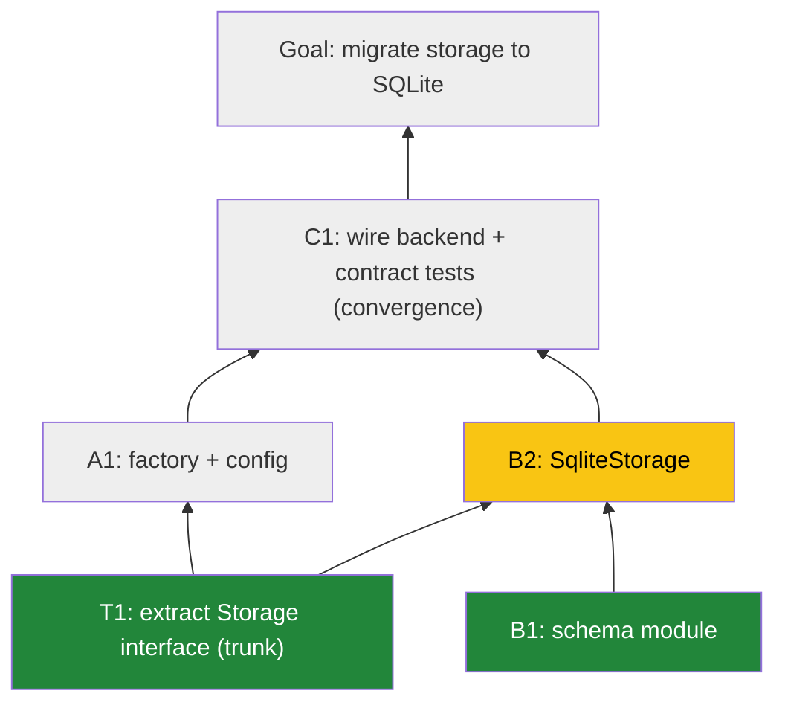

# Agent Instructions

<!-- If you already have an AGENTS.md, paste the section below into it. -->

## Mikado Planning & Parallel Agent Execution

When planning any non-trivial change, use the Mikado Method: build a dependency graph, work from the leaves, and parallelize across independent branches.

### 0. Design decisions before decomposition

Before drawing any tree, enumerate the load-bearing design decisions in a
**"Design decisions"** section at the top of `MIKADO.md`: data model, error &
status conventions, where config/secrets come from, external dependencies,
storage of any shared state. Each decision creates or dissolves cross-branch
edges — most hidden edges discovered mid-flight trace back to a decision nobody
wrote down (e.g. "where do auth tokens live?" decides whether auth depends on
persistence). An undecided item is a planning blocker, not a TODO.

For high-uncertainty areas, prefer a **throwaway spike first** to discover the
real prerequisite structure, then plan; and mark exploratory nodes with a
**risk flag** in the node table so they're sequenced early or conservatively.

### 1. Build the graph

- The **root** is the goal (the user's requested outcome).
- Each **child node** is a prerequisite: a change that must land before its parent can.
- Recurse until every **leaf** is a task that can be done *right now* with no unmet prerequisites.
- The structure is tree-*like* but is really a **DAG**: a node may have prerequisites in more than one branch (cross-branch edges). Record every edge you know of; hunt for shared prerequisites explicitly during planning — especially interfaces/contracts that multiple branches will build against.
- **Trunk-first**: any node that ≥2 branches depend on (shared interfaces, protocols, schemas, contracts) is a **trunk node**. Trunk nodes merge *before* parallel agents spin up. This prevents agents from blocking mid-branch on another branch's work.
- **Contracts specify failure modes, not just signatures.** A trunk contract must pin error cases: status codes, error-body shapes, null/edge behavior, and (where relevant) a reusable conformance test that implementations must pass. Happy-path-only contracts let parallel branches silently diverge and collide at convergence.
- **Contract freeze:** once a trunk contract merges, changing it requires a plan-revision PR that names every dependent branch — never a quiet edit inside a node PR.
- True to Mikado: if you start a node and discover a hidden prerequisite, don't push through — add the edge/node to the graph, park the blocked work, and do the prerequisite first. The graph is a living document; update it as reality corrects the plan.

#### Node requirements

Every node MUST be:

- **Discrete & individually deliverable** — lands on main by itself, leaves the codebase green (builds, tests pass) even if the parent goal isn't reached yet. Use feature flags, parallel implementations, or expand/contract patterns when needed to keep intermediate states shippable.
- **One reviewable PR** — target roughly ≤400 changed lines and a single conceptual change. If a node can't yield a small PR, split it into child nodes.
- **Independent within its branch** — nodes on *different* branches must not touch the same files/modules wherever possible. If two nodes must touch the same area, they belong on the same branch (sequenced), not on parallel branches. Minor overlap is acceptable only when merge conflicts would be trivial.
- **Explicit acceptance criteria** — every node's table row includes a one-line done-condition ("done when: \<observable behavior or named test passes\>"). If you can't write one, the node isn't individually deliverable — split or restructure it.

### 2. Persist the graph

- The canonical graph lives in **`MIKADO.md`** at the repo root (create it in the first PR of the effort).
- It contains: the goal, the Mermaid diagram (see §4), a node table, branch boundaries, and the convergence/collapse plan.
- Node IDs are stable and hierarchical: root is `G`, trunk nodes are `T1`, `T2`…, branches are `A`, `B`, `C`…, nodes are `A1`, `A2`, `B1`… where `A1` must merge before `A2`.
- **Statuses**: `pending` / `in-progress` / `done`. A node's own PR flips its row to `done` and adds the PR link — "done" means "done when this PR merges". No post-merge bookkeeping edits.
- **Conflict hygiene** (critical for parallel agents — verified to merge cleanly):
  - Each node is exactly **one table row on one line**. Agents edit *only their own node's row*.
  - The Mermaid diagram and prose are edited only in planning or plan-revision PRs, never in routine node PRs.
  - Rebase on latest `main` before opening a PR; `MIKADO.md` row conflicts should then be rare and trivially resolvable.

### 3. Parallel agent execution

- After trunk nodes merge, identify the **independent branches** — subtrees whose remaining nodes share no files or tightly coupled modules.
- Spin up **one agent per independent branch**. Each agent works its branch leaf-first, sequentially, one PR per node.
- An agent NEVER starts a node until **all its prerequisite nodes are merged — including cross-branch prerequisites**.
- An agent stays inside its branch's file boundary. If it must touch another branch's territory, the graph is wrong: restructure (usually merge the two branches into one sequenced branch) via a plan-revision PR.

#### Blocked-node protocol

When an agent discovers a hidden prerequisite (in-branch or cross-branch):

1. Park the blocked node; don't half-finish it.
2. If another node in your branch is available, work that; otherwise wait.
3. Record the discovered edge in `MIKADO.md` as part of your node's eventual PR — or, if it changes branch assignments, as a small immediate **plan-revision PR**.

#### Git worktrees — one per agent

- Each parallel agent works in its **own detached worktree**, never a shared checkout:
  `git worktree add --detach ../<repo>-agent-A main`
- Per-node branches are cut from latest `main` inside the worktree: `git checkout -b mikado/<node-id> main` (e.g. `mikado/A1`). No long-lived per-agent git branch — the worktree provides the isolation.
- Rebase on latest `main` before opening each PR and rerun tests; merges to main are serialized.
- On agent collapse (below), remove dead agents' worktrees (`git worktree remove`); the surviving agent continues in its own.

#### Convergence & collapse

- A **convergence node** is a node fed by more than one branch.
- When all feeder branches of a convergence node have merged, the formerly separate agents **collapse to one**: a single agent takes the convergence node and everything above it toward the root. The other agents terminate (or are reassigned to still-open branches elsewhere in the graph).
- Never have two agents active above a convergence point.
- Convergence nodes are where separately built pieces meet a shared contract — they should carry **conformance/contract tests** proving all implementations honor the trunk interface.

#### Scaling beyond 2–3 agents

- **Parallelism is an output of planning, not an input.** Spawn one agent per *genuinely disjoint* subtree; never split branches to hit a target agent count. Codebase hotspots (DI wiring, route tables, config, lockfiles) cap useful parallelism — if two candidate branches share a hotspot, they're one branch.
- **Keep nodes small so the merge queue cycles fast.** Every merge to main obsoletes all other agents' bases; cheap rebases only stay cheap if PRs stay small. The bottleneck at high agent counts is PR review throughput — don't add agents past what review can absorb.
- **Nested convergences need survivors named up front.** With many branches, convergence is usually staged (A+B→C1, D+E→F1, C1+F1→G). The collapse plan must name the surviving agent *per convergence node*, or two survivors will both claim the upper graph.
- **Optional conflict hardening:** add `MIKADO.md merge=union` to `.gitattributes` to eliminate status-table conflicts entirely (safe only because agents edit exactly their own single-line row).

### 4. PR requirements

Every PR description MUST include:

1. **Graph diagram** (Mermaid, snapshot as of this PR) with this PR's node visually marked and merged nodes styled differently:

Legend convention: green = merged, yellow = **this PR**, grey = pending.

2. **Position statement**, one line: `Branch B, node B2 — 2nd of 2 nodes on this branch. Feeds convergence node C1 (also fed by branch A).`
3. **Deliverable statement**: what this PR delivers standalone and why the codebase is safe/green with only this merged.
4. **Unblocks**: which node(s) this merge unblocks, and whether it completes a feeder into a convergence node (triggering agent collapse).
5. **`MIKADO.md` row update**: this node's row flipped to `done` + PR link (same PR).

### 5. Planning output checklist

When asked to plan, produce before any implementation:

- [ ] Design-decisions section (§0) — all load-bearing choices written down and decided
- [ ] Mermaid graph with stable node IDs, including all known cross-branch edges
- [ ] Trunk nodes identified (shared interfaces/contracts) and sequenced before parallel work
- [ ] Node table (ID, description, files/modules touched, acceptance criterion, risk flag, est. PR size) — one line per node
- [ ] Branch → agent assignment with explicit file boundaries per branch
- [ ] Convergence nodes identified, with collapse plan (which agent survives) and contract tests planned
- [ ] `MIKADO.md` created/updated

### 6. Red-team pass, then approval gate

**Red-team the plan before presenting it.** Mechanically verify:

- [ ] For each parallel branch, list every file it will touch; confirm the sets are pairwise disjoint (or overlap is trivially mergeable and justified).
- [ ] For each node, re-hunt prerequisites: what will its code import/read that isn't merged before it starts? Any hit = missing edge.
- [ ] Every design decision in §0 is actually decided — no "TBD" that a branch silently resolves on its own.
- [ ] Every node has an acceptance criterion and every trunk contract specifies failure modes.
- [ ] Convergence nodes are single-concept (wire OR guard OR docs) — a convergence PR that does three things is three nodes.

**Then stop.** Present in chat: the Mermaid graph, the node table (with acceptance criteria), the branch → agent assignments, and anything the red-team pass changed. Do NOT create worktrees, spawn agents, or start any node until the user approves the plan. If the user requests changes, revise and re-present. The same gate applies to plan revisions that restructure branches or change agent assignments (discovered-edge bookkeeping inside a node PR is exempt).
